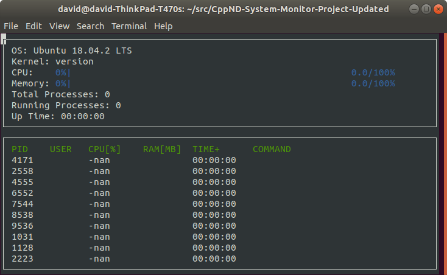

# CppND-System-Monitor
The objective of this project is to build a System Monitor for the Linux OS. It is similar to htop but less sophisticated. 
To run the code: g++ -std="c++17" main.cpp -lncurses
./build/monitor

## ncurses
[ncurses](https://www.gnu.org/software/ncurses/) is a library that facilitates text-based graphical output in the terminal. This project relies on ncurses for display output.

Install ncurses within your own Linux environment: `sudo apt install libncurses5-dev libncursesw5-dev`

## Make
This project uses [Make](https://www.gnu.org/software/make/). The Makefile has four targets:
* `build` compiles the source code and generates an executable
* `format` applies [ClangFormat](https://clang.llvm.org/docs/ClangFormat.html) to style the source code
* `debug` compiles the source code and generates an executable, including debugging symbols
* `clean` deletes the `build/` directory, including all of the build artifacts

## Instructions

1. Clone the project repository: `git clone https://github.com/udacity/CppND-System-Monitor-Project-Updated.git`

2. Build the project: (Note : Delete the build directory existing in the System Monitor Directory. It will cause issues when running cmake) 
 `mkdir build`,
 `cd build`,
 `cmake ..`,
 `make`,

3. Run the resulting executable: `./build/monitor`

4. Implement the `System`, `Process`, and `Processor` classes, as well as functions within the `LinuxParser` namespace.
